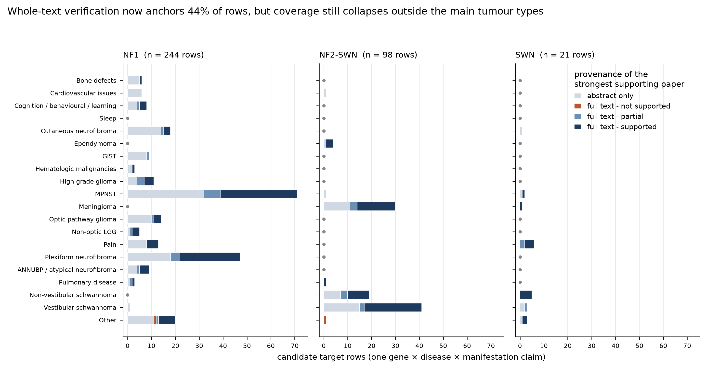

# Phase 1b: literature-derived candidate targets

A PubMed sweep of 32 disease- and manifestation-directed queries returned 492 articles, of which 303 named at least one molecular target presented as a driver, modifier, or therapeutic target in neurofibromatosis. After extraction, two rounds of full-text verification, and the exclusions described below, the list stands at **363 gene x disease x manifestation rows over 191 target labels, drawn from 235 papers**. **193 of those rows are now anchored in at least one paper read in full**, against 54 in the first version; 170 still rest on abstracts alone and are labelled as such. The list is `data/phase1b-literature-targets.csv`; the paper-level record, including per-paper access, is `data/phase1b-references.csv`.

This list is deliberately independent of the expression pipeline. It is held for the Phase 7 comparison, where overlaps and one-sided findings between the two derivations get examined.

## Whole-text verification pass

The first version of this list had a provenance problem that the numbers above have largely fixed. Full text had been retrieved for only 56 of the contributing papers, and part of that verification was done from short gene-centred excerpts rather than complete articles after the run exhausted its token budget, leaving those verdicts provisional.

Both limits came from the retrieval route rather than from access. The PubMed connector fetches through NCBI's PMC service, which serves only its own open-access package, so most PMC-identified papers returned empty bodies. Europe PMC holds a larger open subset at a different endpoint, and **89 of the 235 papers turned out to be open access there**. Every row-paper pair among them, 254 in total, was re-judged against the complete article body, one reasoning pass per paper, with no excerpting. Full text now covers **108 of 235 papers**.

The re-judgement changed the list in four ways.

**Verdicts.** Of 254 pairs, 156 came back supported, 55 partially supported, and 43 not supported. The supported fraction rose from 12 percent of rows to 44 percent.

**Twenty rows were dropped.** Each was a single-paper claim whose one paper, read in full, does not support it: the gene appears as a cohort-defining mutation, an assay reagent, or a citation to other work. Among them are ALK and CAMP-PKA in MPNST, EPHA2 and KIT in vestibular schwannoma, PEBP1 in meningioma and ependymoma, and every one of the four Sleep rows. Two further rows (MAP2K1/2 in NF1 "Other", NF2 in NF2-SWN "Other") had all their read papers come back not supported but still have unread papers, so they were kept and tiered `full text - not supported` rather than dropped on partial coverage.

**Sleep is now empty.** It held four rows, all abstract-derived, and all four failed whole-text verification. This is a real result rather than a gap in searching: no paper in this corpus presents a molecular target for sleep disturbance in NF.

**Forty-two paper-level assignments moved manifestation** on the same paper-level rule used earlier. PAK1/2, for instance, moved from vestibular to non-vestibular schwannoma because that is what the body studies.

**Five further assignments were moved by hand on review of the "Other" bucket.** Three papers had been filed there although they study a manifestation the vocabulary already covers: a paper on the spinal manifestations of NF1 (RAS pathway) moved to Bone defects, one on the metabolic and behavioural effects of neurofibromin (PI3K-AKT-MTOR axis) moved to Cognition / Behavioral / Learning, and two on atypical neurofibroma (CDKN2A, CDKN2B) moved to ANNUBP / atypical neurofibroma, where CDKN2A now carries 10 supporting papers. CDKN2A retains one "Other" assignment from a nerve-injury paper that studies neither. What is left in "Other" is four distinct things: whole-disease review claims with no manifestation to attach to, normal Schwann-cell and nerve-injury biology, assay-level findings with no phenotype, and real NF phenotypes absent from the fixed vocabulary (retinal neovascularization, pheochromocytoma, cafe-au-lait macules). The first of those is a structural gap: the vocabulary has no disease-level slot, so every future extraction pass will pool general claims with specific ones until one is added.

No row now rests on the excerpt-based verdicts. Five rows (CACNA1B, CRMP2 and NF1 in NF1 pain, MTOR in NF2-SWN meningioma, BIRC5 in NF1 MPNST) were held over because their papers sit outside the Europe PMC open-access set, but the bodies were already in hand from the first round; they were re-judged separately over complete text and all five came back supported, which brings the whole-body total to 263 pairs.

## Scope decisions carried forward

**Sporadic tumours are excluded.** Evidence that could not be attributed to NF1, NF2-SWN, or SWN was removed rather than carried as "Not specified", which is why meningioma appears only under NF2-SWN and high-grade glioma is NF1-only.

**Family and pathway labels are kept, and expanded rather than replaced.** `constituent_genes` lists the HGNC symbols that are either the named target or the members of the named family or complex (246 distinct symbols across 191 labels), and `label_type` says what kind of entity each label is (gene 268, family 53, pathway 22, complex 14, drug 3, other 2, miRNA 1), so an empty `constituent_genes` is interpretable rather than ambiguous. Symbols were validated against official HGNC symbols only; alias matching was tried and rejected because it silently maps SPP1 to CXXC1, ATR to MMAB, and MIF to AMH. Three drug names that had leaked into the target column (bevacizumab, simvastatin, apocynin) are typed `drug` and mapped to the gene each acts on.

## NF1

244 rows. The MEK1/2 axis dominates and is the only NF-relevant target in this sweep with regulatory-grade human evidence. Selumetinib in inoperable plexiform neurofibroma is the strongest row in the whole list, 34 supporting papers with 10 independently confirmed in full text, running from the phase 1 dose-finding cohort ([Dombi 2016](https://doi.org/10.1056/NEJMoa1605943)) through the phase 2 SPRINT trial that supported approval ([Gross 2020](https://doi.org/10.1056/NEJMoa1912735)) to longer-term safety and efficacy data ([Kim 2024](https://doi.org/10.1093/neuonc/noae121)). The same node carries into NF1-associated glioma, both optic pathway and non-optic low-grade.

Malignant progression is the second well-supported axis and is a loss-of-function story rather than a druggable-kinase one. *CDKN2A* deletion marks the plexiform to atypical transition ([Chaney 2020](https://doi.org/10.1158/0008-5472.CAN-19-1429)), and PRC2 component loss separates MPNST from its benign precursors ([Cortes-Ciriano 2023](https://doi.org/10.1158/2159-8290.CD-22-0786)). Both are tumour-suppressor losses: strong stratification markers, poor direct drug targets, which is the direction-of-effect distinction the Phase 6 rubric has to encode.

NF1 pain retains a mechanistically coherent set built on the neurofibromin-CRMP2 interface and downstream N-type calcium channel regulation ([Moutal 2017](https://doi.org/10.1097/j.pain.0000000000001026); [Khanna 2019](https://doi.org/10.1097/j.pain.0000000000001648)), and is the clearest non-tumour manifestation with a nameable target. Both nodes were re-read over complete text in the final pass and confirmed: CRMP2 freed from neurofibromin drives CaV2.2 and NaV1.7 trafficking in sensory neurons, shown by CRISPR truncation of Nf1.

## NF2-SWN

98 rows. Merlin loss converges on the Hippo pathway and on PAK and PI3K signalling, and the therapeutic literature is preclinical or early-phase rather than approved. Everolimus reached a phase 0 trial in vestibular schwannoma and meningioma ([Karajannis 2021](https://doi.org/10.1158/1535-7163.MCT-21-0143)). Whole-text reading strengthened the Hippo node: YAP1-TEAD in vestibular schwannoma, dropped from the first version as an unattributable "Other" row, is now a supported row in its proper manifestation, and merlin-dependent PAK and TEAD activation is confirmed in NF2-deficient schwannoma lines ([Benton 2024](https://doi.org/10.1371/journal.pone.0305121)), though the PAK1/2 row itself reads as partial and belongs to non-vestibular schwannoma. Merlin-deficient meningioma has been targeted through NEDD8-pathway and selumetinib combination ([Lyons Rimmer 2020](https://doi.org/10.3390/cancers12071744)), which verified cleanly across four pairs.

VEGFA remains the one NF2 target with real-world clinical use, bevacizumab for NF2-associated vestibular schwannoma ([Fujii 2020](https://doi.org/10.2176/nmc.oa.2019-0194)). Spatial profiling of the same tumours adds a target the abstract sweep would have missed: CD44-positive Schwann cells are more abundant in bevacizumab-failure tumours ([Jones 2025](https://doi.org/10.1038/s41467-025-57586-z)), a resistance marker rather than a primary target, and the kind of row that only appears when the body is read.

## SWN (schwannomatosis)

21 rows, still the thinnest of the three, and its targets are the predisposition genes themselves. *LZTR1* in non-vestibular schwannoma is now the second-strongest row in the list (13 papers, 4 confirmed in full text), resting on germline loss-of-function predisposition ([Piotrowski 2013](https://doi.org/10.1038/ng.2855)) and on LZTR1 acting in a CUL3 complex that ubiquitinates RAS ([Steklov 2018](https://doi.org/10.1126/science.aap7607)), which puts SWN back on the RAS axis shared with NF1 and makes it the best cross-disease mechanistic link to carry into Phase 5. *SMARCB1*-driven disease follows at 11 papers. Pain, the dominant clinical problem in schwannomatosis, produced six rows and no target with a mechanism beyond the predisposition genes, which is a genuine gap rather than a search artefact.

## Coverage by disease and manifestation

Distinct gene x manifestation rows, germline-attributable evidence only.

| Manifestation | NF1 | NF2-SWN | SWN | Total |
|---|---|---|---|---|
| Bone defects | 6 | 0 | 0 | 6 |
| Cardiovascular issues | 6 | 1 | 0 | 7 |
| Cognition / Behavioral / Learning | 8 | 0 | 0 | 8 |
| Sleep | 0 | 0 | 0 | 0 |
| Cutaneous neurofibroma | 18 | 0 | 1 | 19 |
| Ependymoma | 0 | 4 | 0 | 4 |
| Gastrointestinal stromal tumor (GIST) | 9 | 0 | 0 | 9 |
| Hematologic malignancies | 3 | 0 | 0 | 3 |
| High grade glioma | 11 | 0 | 0 | 11 |
| Malignant peripheral nerve sheath tumor (MPNST) | 71 | 1 | 2 | 74 |
| Meningioma | 0 | 30 | 1 | 31 |
| Optic pathway glioma | 14 | 0 | 0 | 14 |
| Non-optic LGG | 5 | 0 | 0 | 5 |
| Pain | 13 | 0 | 6 | 19 |
| Plexiform neurofibroma | 47 | 0 | 0 | 47 |
| ANNUBP / atypical neurofibroma | 9 | 0 | 0 | 9 |
| Pulmonary disease | 3 | 1 | 0 | 4 |
| Non-vestibular schwannoma | 0 | 19 | 5 | 24 |
| Vestibular schwannoma | 1 | 41 | 3 | 45 |
| Other | 20 | 1 | 3 | 24 |

**Figure 1. Coverage and verification depth by disease and manifestation.** Bar length is the number of candidate target rows (n = 363 gene x disease x manifestation claims); shading is the provenance of the strongest supporting paper behind each row. Panels share an x axis, so bar lengths are comparable across diseases; a grey dot marks a manifestation with no rows at all in that disease. 158 of 363 rows (44 percent) are anchored in a paper read in full, and among the five manifestations holding 20 or more rows that share runs from 35 to 59 percent, so the principal tumour types are now reasonably well evidenced. What the figure shows instead is how sharply coverage falls away from them: Sleep (0), Hematologic malignancies (3), Ependymoma (4), Pulmonary disease (4), Non-optic LGG (5), Bone defects (6), Cardiovascular issues (7), Cognition / Behavioral / Learning (8), Gastrointestinal stromal tumor (GIST) (9), ANNUBP / atypical neurofibroma (9) rows respectively, and no full-text-supported target at all for Cardiovascular issues, Gastrointestinal stromal tumor (GIST).

## Access and verification

Full text was read for 108 of 235 papers: 89 open access via Europe PMC and the remainder from the earlier NCBI pass. The 127 that remain unread are not open access anywhere Europe PMC indexes. A PMC identifier is not a proxy for full-text access and should not be treated as one in later phases.

| Evidence tier | Rows |
|---|---|
| full text - supported | 158 |
| full text - partial | 33 |
| full text - not supported | 2 |
| abstract only | 170 |

Every row carries `paper_access` per PMID, plus `verdicts_from_whole_body` and `verdicts_from_earlier_pass` so the two verification rounds stay distinguishable.

## Limitations

Extraction is model-based over abstracts and verification is a single-reader model pass over full text, with no second reader and no adjudication of disagreements. Verdicts are one reviewer's calls. Recall against a gold standard has not been measured in either direction.

Rows that remain abstract-only are not weaker claims about biology, they are claims nobody has checked. The 170 in that tier should not be compared directly against the 158 confirmed rows when Phase 7 weights evidence.

Excluding sporadic-tumour evidence is a deliberate scope choice, not a statement that the evidence is weak. Somatic *NF2* loss in sporadic meningioma and schwannoma is the same molecular lesion as the germline case.

Queries were capped at 18 results each and date-filtered from 2005, so highly cited older primary work is under-represented, and citation-graph expansion was not performed.

## Method

Thirty-two PubMed queries spanning NF1, NF2-SWN, and SWN crossed with the plan's fixed manifestation vocabulary (`search_articles`, relevance-sorted, 18 results per query, `date_from=2005`) returned 492 unique PMIDs; metadata and abstracts were retrieved for 482. Each abstract was passed to a model extraction step returning gene, disease, manifestation(s) from the fixed list, role, mechanism, and study system, with instructions not to extract cohort-defining gene mentions or assay reagents. Gene strings were normalised, manifestations validated against the fixed vocabulary verbatim, and disease coerced to NF1 / NF2-SWN / SWN.

Verification ran in two rounds. The first used NCBI PMC and covered 56 papers, part of it from excerpts. The second identified open-access availability through the Europe PMC REST API (`/{PMCID}/fullTextXML`), fetched 89 complete article bodies, stripped reference sections, and re-judged all 254 row-paper pairs among them with one reasoning call per paper. A third short pass recovered the bodies of the remaining papers that the first round had read but judged from excerpts, from Europe PMC or NCBI efetch, and re-judged those 9 pairs the same way, for 263 whole-body pairs in total. Where the two rounds disagree, the whole-body verdict wins. Manifestation corrections are applied per paper, not per row, so a paper that turns out to study a different manifestation moves only its own support.

## Files

- `data/phase1b-literature-targets.csv`: 363 rows, one per gene x disease x manifestation, with `constituent_genes`, `label_type`, mechanism, study system, supporting PMIDs, per-paper access, per-round verdict counts, and evidence tier
- `data/phase1b-references.csv`: 235 contributing papers with DOI, PMC id, whether full text was read and from which source, the target labels each paper supports, and a resolvable link
- `data/phase1b-coverage.csv`: the coverage matrix above in machine-readable form
- `docs/figures/phase1b-coverage-verification.png`: Figure 1
