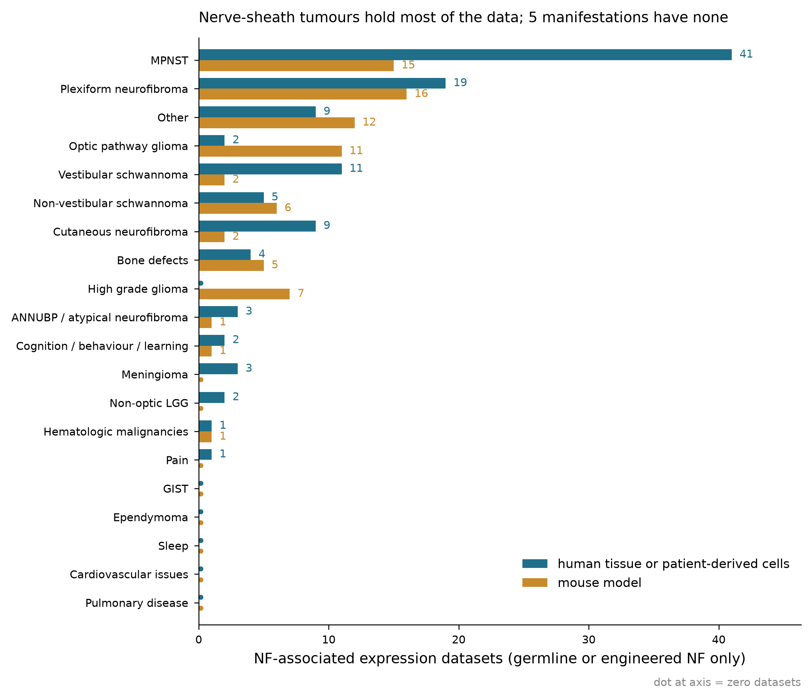

# Phase 1a: Public expression-dataset scope for NF1 / NF2-SWN / schwannomatosis

**Status:** complete, pending review. **Sweep date:** 2026-09-29 (first run 2026-09-24).
**Scripts:** `phase-1a/scripts/phase1a_geo_search.py` (search), `phase-1a/scripts/phase1a_classify.py` (rubric +
cache restore), `phase-1a/scripts/phase1a_build_tables.py` (tables).
**Tables:** `phase-1a/data/phase1a-datasets.csv`, `phase-1a/data/phase1a-dataset-labels.csv`, `phase-1a/data/phase1a-samples.csv`,
`phase-1a/data/phase1a-excluded.csv`, `phase-1a/data/phase1a-coverage.csv`, `phase-1a/data/phase1a-queries.csv`.

## Scope statement

The pipeline's headline output is a prioritised, evidence-scored list of candidate drug targets.
Batch-effect correction and the handling of datasets without healthy controls are secondary
capabilities, not the deliverable. Phase 1 fixes the input side of that: which public expression
datasets exist for germline NF disease, what they actually contain, and which of them a
differential-expression step could use.

Sporadic tumours are out of scope (see the labeling standard in `docs/project-plan.md`). A dataset
counts only where the record shows germline NF status, an NF patient cohort, an engineered
*Nf1*/*Nf2*/*Smarcb1*/*Lztr1* genotype, or a cell line identified as NF-patient-derived. Mixed
cohorts are kept, with the sporadic samples marked and excluded at sample level.

## Headline

| | count |
|---|---|
| GEO series retrieved (27 queries, expression assay types, series only) | 415 |
| Excluded after reading the record | 235 |
| In scope | 180 GEO + 5 ArrayExpress = 185 |
| Counted after superseries/subseries dedup | 160 |
| Samples labelled individually | 4,634 |
| Samples in scope (NF cases + their controls) | 3,662 |
| Samples excluded as sporadic | 330 |

Of the 235 exclusions, 152 were not NF-related at all (the string "NF1" in GEO also picks up nuclear
factor 1, and *NF1* as one mutated gene among many in sporadic cancer), 80 were sporadic tumours with
somatic *NF1*/*NF2* loss, and 3 were NF-related but out of scope for other reasons recorded in
`phase1a-excluded.csv`. Meningioma is where the sporadic rule bites hardest: the keyword sweep returns
hundreds of meningioma series, and 3 survive it.

## Human vs mouse — the decision this run was meant to inform

Both were collected, with `organism` as a column. Of the 160 counted datasets: **78 human, 70 mouse,
9 mixed human+mouse, 2 zebrafish, 1 rat**. So dropping mouse would remove roughly 45% of the
collection, but that is not the reason to keep it — the reason is *where* the mouse data sits.

| manifestation | human datasets | mouse datasets | human samples | mouse samples |
|---|---|---|---|---|
| MPNST | 41 | 15 | 1,093 | 270 |
| Plexiform neurofibroma | 19 | 16 | 548 | 220 |
| Optic pathway glioma | 2 | 11 | 34 | 132 |
| High grade glioma | 0 | 7 | 0 | 404 |
| Vestibular schwannoma | 11 | 2 | 120 | 36 |
| Cutaneous neurofibroma | 9 | 2 | 310 | 37 |
| Non-vestibular schwannoma | 5 | 6 | 90 | 70 |
| Bone defects | 4 | 5 | 370 | 25 |
| ANNUBP / atypical neurofibroma | 3 | 1 | 61 | 20 |
| Cognition / Behavioral / Learning | 2 | 1 | 32 | 30 |
| Meningioma | 3 | 0 | 32 | 0 |
| Non-optic LGG | 2 | 0 | 40 | 0 |
| Hematologic malignancies | 1 | 1 | 5 | 6 |
| Pain | 1 | 0 | 18 | 0 |
| Other | 9 | 12 | 141 | 83 |
| Cardiovascular issues, Sleep, Ependymoma, GIST, Pulmonary disease | 0 | 0 | 0 | 0 |

Mixed human+mouse series are counted in the human column. Full detail, including the disease
dimension and explicit zero rows, is in `phase-1a/data/phase1a-coverage.csv`.

Reading: human data carries the nerve-sheath tumours (MPNST, plexiform and cutaneous neurofibroma,
vestibular schwannoma). Mouse data carries the CNS manifestations — optic pathway glioma is 11 mouse
against 2 human, and NF1 high-grade glioma is mouse-only. Human-only would therefore not just shrink
the collection, it would make optic pathway glioma and high-grade glioma structurally unavailable to
Phase 3, and a zero in the Phase 3b chart would then mean "we excluded the only data there is" rather
than "no evidence". Recommendation: keep mouse in Phase 1 and 3 as a separate track with ortholog
mapping, and let Phase 3b decide manifestation by manifestation.

## What is actually usable for Phase 2 and 3

Dataset count is not analysis capacity. Of the 160 counted datasets:

- **Study design:** 71 in vitro perturbation, 28 tumour-subtype or grade comparison, 20 tumour vs
  normal, 20 xenograft or in vivo treatment, 12 single-arm profiling, 9 other. Only the 48
  comparative designs (tumour vs normal, subtype/grade) feed a differential-expression step directly;
  the perturbation series are drug- or gene-response experiments on NF cell lines, useful later for
  target validation but not for case-control DE.
- **Controls:** 86 datasets contain at least one control sample. Across all labelled samples there
  are 481 isogenic/engineered controls (wild-type littermates, parental lines, *NF1*/*NF2*-restored
  lines), 178 matched adjacent normal, and 91 unaffected-donor normal. Matched normal *nerve* is the
  scarce commodity; most human tumour series have no normal comparator at all, which is what makes
  the no-control fallback in Phase 2 load-bearing rather than optional.
- **Data availability:** 92 datasets ship raw array files, 43 raw counts, 16 processed matrices only,
  7 other supplementary formats, 2 nothing (RNA-seq raw reads remain reachable via SRA for 40).
- **Single-cell/single-nucleus:** 28 datasets, collected and marked, deferred for compute per the
  plan.

Leading human comparative candidates (largest in-scope sample counts):

| accession | manifestation(s) | in-scope samples | NF cases | controls | design |
|---|---|---|---|---|---|
| GSE41747 | cutaneous + plexiform neurofibroma | 83 | 65 | 18 | tumour vs normal |
| GSE14038 | plexiform + cutaneous neurofibroma, MPNST | 76 | 66 | 10 | tumour vs normal |
| GSE120687 | cutaneous + plexiform neurofibroma | 74 | 28 | 23 | subtype/grade |
| GSE145064 | plexiform neurofibroma, MPNST | 46 | 46 | 0 | subtype/grade |
| GSE239561 | plexiform neurofibroma, ANNUBP | 34 | 34 | 0 | subtype/grade |
| GSE141801 | vestibular schwannoma | 23 | 13 | 7 | subtype/grade |
| GSE163071 | optic pathway glioma | 22 | 13 | 9 | subtype/grade |

Leading mouse comparative candidates: GSE102345 (optic pathway glioma, 67 samples), GSE265875
(MPNST, 29), GSE289794 (cutaneous neurofibroma, 25, single-cell), GSE78895 (high-grade glioma, 23),
GSE78901 (plexiform neurofibroma, 21).

## Method

1. **Search.** 27 E-utilities queries against GEO DataSets (`db=gds`), one per manifestation in the
   labeling standard plus disease-level and mouse-model catch-alls, each restricted to
   `gse[ETYP]` and to expression DataSet Types. Query strings, hit counts and the run date are in
   `phase-1a/data/phase1a-queries.csv`. Restricting to expression assay types removes 25–35% of raw keyword
   hits (ChIP-seq, ATAC, methylation, miRNA); a few multi-assay series still enter because their
   DataSet Type lists expression alongside something else.
2. **Record retrieval.** For every hit, the series SOFT header plus every sample's SOFT header
   (title, source, characteristics, library strategy). 12,778 sample records for 415 series; 2 series
   above the 400-sample fetch cap are marked rather than fetched.
3. **Classification.** One LLM pass per series against the scope rubric in `phase-1a/scripts/phase1a_classify.py`
   (disease, manifestations, NF association and its basis, material, study design, single-cell,
   control types), then one pass per in-scope series over its sample rows to label each sample. The
   rubric instructs the model to judge only from the record and to treat absence of germline evidence
   as out of scope.
4. **ArrayExpress.** Six free-text searches returned 246 experiments, 59 of them not mirrored from
   GEO, 13 NF-related by title, 5 in scope after reading each record. They are curated by hand in
   `phase-1a/data/phase1a-arrayexpress-additions.json`: E-MEXP-258, E-MEXP-2766, E-MTAB-13334, E-MTAB-14222,
   E-TABM-69. The rest were aCGH, methylation, targeted resequencing or CRISPR/shRNA screens rather
   than expression profiling, or had no germline NF evidence.
5. **Dedup.** A subseries whose superseries is also in the sweep is kept as a row but not counted in
   coverage (25 such rows).

## Caveats

- **The classification is a single LLM pass with no second reader.** Of the 155 counted GEO datasets,
  121 are marked high confidence, 32 medium and 2 low; the medium/low ones are worth a human look
  before Phase 2 ingests them. 386 of 4,634 samples (8.3%) could not be labelled from their metadata
  and are `other_or_unclear`.
- **Sample metadata quality varies.** GSE108524 carries disease state and NF2 symptom age per sample;
  GSE14038 — 86 samples, one of the canonical NF tumour series — carries no sample characteristics at
  all, so its labels come from sample titles. Control counts are derived, not read off a GEO field.
- **Superseries/subseries share samples.** 188 GSMs appear under two accessions; the sample table
  keeps one row per (series, sample) pair, and 43 of those shared samples received different labels
  under their two series contexts. Coverage counts use the deduped dataset set, so this does not
  inflate dataset counts, but it does mean the sample table is not a unique GSM list.
- **The ArrayExpress additions have no sample-level labels**, so they contribute to dataset counts
  and not to sample counts. Their `n_samples` is an assay/hybridisation count, which is not the same
  as a biological sample count.
- **Keyword recall.** A series that never names its disease, manifestation or an NF gene in title,
  summary or sample metadata is invisible to this sweep. The five zero-coverage manifestations
  (cardiovascular, sleep, ependymoma, GIST, pulmonary) match the thin literature Phase 1b found in
  the same areas, which is consistent with a real absence rather than a search artefact — but it is
  keyword evidence, not proof.
- **GEO moves.** The 2026-09-24 run returned 414 series; the 2026-09-29 re-run returned 415. The new
  record (GSE344687, NF2-associated vestibular schwannoma multiome) was classified by hand and is
  recorded in `phase-1a/data/phase1a-manual-classifications.json`. LLM classification is not deterministic, so
  the committed tables — not a re-run — are the record of this sweep.

## Open decisions

1. **Mouse in or out for Phases 2–3.** Recommendation above: keep, as a separate track.
2. **Which comparative datasets launch Phase 2.** The seven human candidates above plus the mouse
   set are the realistic starting list; the plan's open item "decide final list of GEO datasets to
   launch with" can be closed from `phase1a-datasets.csv` filtered to `comparative_design = True`.
3. **Zero-coverage manifestations.** Cardiovascular issues, Sleep, Ependymoma, GIST and Pulmonary
   disease have no expression dataset at all under the sporadic exclusion. They should appear as
   explicit zeros in the Phase 3b chart, not be dropped from it.
4. **Medium/low-confidence classifications** (35 of the 160 counted datasets) — worth a human pass
   before ingestion.
