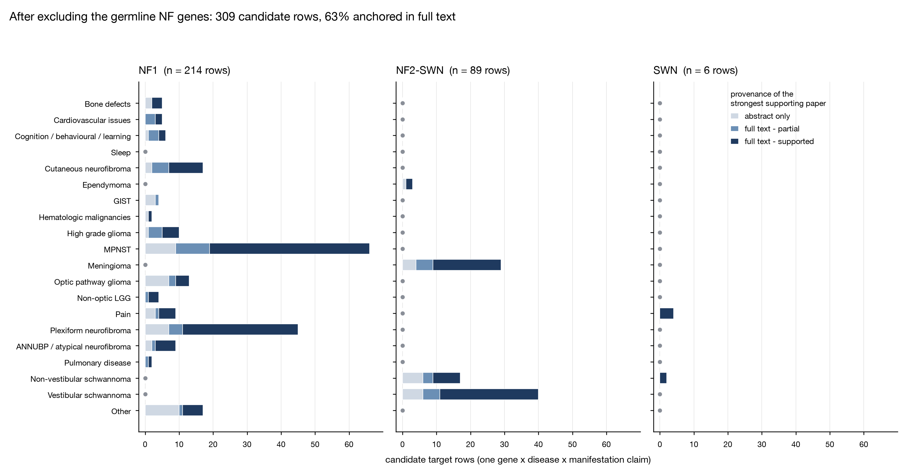

# Phase 1b: literature-derived candidate targets

Phase 1b asks what the published literature already proposes as a molecular target in
neurofibromatosis, and how well each of those proposals is actually evidenced. It is
deliberately independent of the expression arm of the pipeline: no expression data was
consulted, and the list is held for the Phase 7 comparison, where agreements and
one-sided findings between the two derivations are examined. Every target carries a
disease label (NF1, NF2-SWN, SWN) and one or more manifestations from the project's
fixed twenty-term vocabulary, applied verbatim.

The phase is complete. It produced a **candidate list of 309 gene x disease x
manifestation rows over 182 target labels covering 247 distinct
gene symbols, drawn from 234 papers**, of which 155 were read
in full. 244 of the 309 rows are anchored in at least one paper
verified against its complete text; 65 rest on abstracts alone
and are labelled as such. A wider annotated table of 348 rows is retained
for audit, the difference being the germline NF genes excluded as targets.

## Outputs

| File | What it holds |
|---|---|
| `phase-1b/data/phase1b-candidate-targets.csv` | The prioritisation input. 309 rows, germline NF genes excluded. |
| `phase-1b/data/phase1b-literature-targets.csv` | All 348 verified rows with a `driver_gene` flag, for audit. |
| `phase-1b/data/phase1b-references.csv` | 234 papers: DOI, PMC id, access route, preprint status, targets supported, manifestations covered, resolvable link. |
| `phase-1b/data/phase1b-coverage.csv` | The coverage matrix below, machine-readable. |
| `phase-1b/data/phase1b-target-annotations.csv` | Per-label curated flags: biomarker-like, mutation-restricted, microenvironment target. |
| `phase-1b/data/phase1b-upload-priority.csv` | PDF queue and progress tracker: 40 papers still worth fetching. |
| `phase-1b/docs/figures/phase1b-coverage-verification.png` | Figure 1. |
| `phase-1b/scripts/make_phase1b_figure.py` | Regenerates Figure 1 from the candidate table. |
| `phase-1b/scripts/build_phase1b_report.py` | Regenerates this document from the tables. |

## How the list was built

1. **Search.** 32 PubMed queries spanning NF1, NF2-SWN and SWN crossed with the fixed manifestation vocabulary, relevance-sorted, 18 results per query, `date_from=2005`, returned 492 unique PMIDs; metadata and abstracts were retrieved for 482. 303 of those papers named at least one molecular target presented as a driver, modifier or therapeutic target.
2. **Abstract extraction.** Each abstract was passed to a model extraction step returning gene, disease, manifestation(s) from the fixed list, role, mechanism and study system, with explicit instructions not to extract cohort-defining gene mentions or assay reagents. Calls that failed transiently were re-run rather than dropped.
3. **Symbol normalisation.** Gene strings were mapped through an alias table and validated against official HGNC symbols. Alias-permissive matching was rejected after it mapped common shorthand onto unrelated genes, so validation uses official symbols only with the residue curated by hand. Labels that are genuinely a family, complex or pathway are kept as the label and expanded in `constituent_genes`, with `label_type` recording which kind of entity each is: gene (216), family (52), pathway (22), complex (13), drug (3), other (2), miRNA (1). Two labels are not gene products at all. HYALURONAN, a glycosaminoglycan, carries the enzymes that synthesise and degrade it in `constituent_genes` (HAS1-3, HYAL1-4, SPAM1, CEMIP, CEMIP2) so that later phases have something to query, and those symbols are curated rather than extracted from the paper, which measures the polysaccharide itself. The clemastine row names a drug effect with no target attached and is still unexpanded.
4. **First verification round.** Full text was sought through the PubMed connector's NCBI PMC route, which reached 56 papers. Part of that round was judged from short gene-centred excerpts rather than complete articles, which left those verdicts provisional. Both limits were later traced to the retrieval route rather than to access.
5. **Review round.** Four scope decisions were applied: rows whose disease could not be attributed were dropped, excluding sporadic tumours from the project (168 rows, from a first version of 547); 2 rows that failed verification outright were dropped; manifestation labels were corrected from full text at the level of the individual paper rather than the whole row; and family labels were kept with the `constituent_genes` column added.
6. **Whole-text verification.** Europe PMC's `/{PMCID}/fullTextXML` endpoint holds a larger open-access subset than the NCBI route, and 89 of the papers proved retrievable there. All 254 row-paper pairs among them were re-judged against complete bodies, reference sections stripped, one reasoning pass per paper, no excerpting. 20 single-paper rows were dropped as contradicted by their own paper on full reading.
7. **Excerpt cleanup.** The remaining pairs still carrying excerpt-based verdicts were re-judged over complete bodies recovered from Europe PMC or NCBI efetch (9 pairs). No row now rests on an excerpt verdict.
8. **Author-manuscript harvest.** Open-access status and readability turned out to be different things: an NIH author manuscript can sit free in PMC while the publisher version is paywalled, and Europe PMC's open-access endpoint refuses those while NCBI efetch serves them. That route added 28 papers and 35 judged pairs at no cost.
9. **Supplied PDFs.** 29 PDFs were supplied from subscription access for papers no free route could reach. All matched corpus papers by DOI, or by title where the file carried none; 9 were papers already read by another route. The other 20 were read in full and their 64 pairs judged on the same rubric (37 supported, 15 partially supported, 12 not supported). 52 rows moved up a tier, 11 abstract-only rows were removed as contradicted, and 16 rows were dropped in total.
10. **Manifestation cleanup.** Papers filed under "Other" that in fact study a vocabulary manifestation were moved: 5 by hand on review, alongside 45 moved automatically where the full text disagreed with the abstract. All moves are per paper, so a paper that studies a different manifestation moves only its own support.
11. **Preprint flagging.** 6 papers are preprints rather than peer-reviewed articles (bioRxiv (4), Research Square (2)). `is_preprint` and `preprint_server` mark them per paper; `n_preprint_papers` and `preprint_only` mark the rows that depend on them.
12. **Driver-gene exclusion.** The germline NF disease genes were excluded as candidates, on the grounds that their role is established and re-prioritising them tells the project nothing.

Verdicts from a later round override earlier ones, and 292 of the row-paper pairs behind the current list have been judged against a complete article body.

## The current list

| Evidence tier | Rows |
|---|---|
| full text - supported | 194 |
| full text - partial | 50 |
| abstract only | 65 |

By disease: NF1 214 rows, NF2-SWN 89,
SWN 6. No row here is contradicted by its own papers: rows whose
full text does not support the claim are excluded from the candidate list and kept only in
the audit table, where their tier and supporting papers remain visible. The
`full text - partial` tier is different and stays: the target is real but the disease or
manifestation attribution is looser than the row claims.

## Coverage by disease and manifestation

| Manifestation | NF1 | NF2-SWN | SWN | Total |
|---|---|---|---|---|
| Bone defects | 5 | 0 | 0 | 5 |
| Cardiovascular issues | 5 | 0 | 0 | 5 |
| Cognition / Behavioral / Learning | 6 | 0 | 0 | 6 |
| Sleep | 0 | 0 | 0 | 0 |
| Cutaneous neurofibroma | 17 | 0 | 0 | 17 |
| Ependymoma | 0 | 3 | 0 | 3 |
| Gastrointestinal stromal tumor (GIST) | 4 | 0 | 0 | 4 |
| Hematologic malignancies | 2 | 0 | 0 | 2 |
| High grade glioma | 10 | 0 | 0 | 10 |
| Malignant peripheral nerve sheath tumor (MPNST) | 66 | 0 | 0 | 66 |
| Meningioma | 0 | 29 | 0 | 29 |
| Optic pathway glioma | 13 | 0 | 0 | 13 |
| Non-optic LGG | 4 | 0 | 0 | 4 |
| Pain | 9 | 0 | 4 | 13 |
| Plexiform neurofibroma | 45 | 0 | 0 | 45 |
| ANNUBP / atypical neurofibroma | 9 | 0 | 0 | 9 |
| Pulmonary disease | 2 | 0 | 0 | 2 |
| Non-vestibular schwannoma | 0 | 17 | 2 | 19 |
| Vestibular schwannoma | 0 | 40 | 0 | 40 |
| Other | 17 | 0 | 0 | 17 |

**Figure 1. Coverage and verification depth by disease and manifestation.** Bar length is
the number of candidate target rows (n = 309 claims, germline NF genes
excluded); shading is the provenance of the strongest supporting paper behind each row.
Panels share an x axis, so bar lengths are comparable across diseases; a grey dot marks a
manifestation with no rows at all in that disease. 194 of
309 rows (63 percent) are anchored in a paper read in full, and
in the 4 manifestations holding 20 or more rows that share runs from
69 to 76 percent, so the principal tumour types are well evidenced.
What the figure shows is how sharply coverage falls away from them: Hematologic malignancies (2), Pulmonary disease (2), Ependymoma (3), Gastrointestinal stromal tumor (GIST) (4), Non-optic LGG (4), Bone defects (5), Cardiovascular issues (5), Cognition / Behavioral / Learning (6), ANNUBP / atypical neurofibroma (9) rows
respectively, no rows at all for Sleep, and no full-text-supported target
for Gastrointestinal stromal tumor (GIST).

## What the evidence says

### NF1

214 rows. The MEK1/2 axis dominates and is the only NF-relevant target
in this sweep with regulatory-grade human evidence. Selumetinib in inoperable plexiform
neurofibroma is the strongest row in the list (34 supporting
papers), running from the phase 1 dose-finding cohort
([Dombi 2016](https://doi.org/10.1056/NEJMoa1605943)) through the phase 2 SPRINT trial that
supported approval ([Gross 2020](https://doi.org/10.1056/NEJMoa1912735)) to longer-term
safety and efficacy data ([Kim 2024](https://doi.org/10.1093/neuonc/noae121)). The same node
carries into NF1-associated glioma, both optic pathway and non-optic low-grade.

Malignant progression is the second well-supported axis, and it is a loss-of-function story
rather than a druggable-kinase one. *CDKN2A* deletion marks the plexiform to atypical
transition ([Chaney 2020](https://doi.org/10.1158/0008-5472.CAN-19-1429)), and PRC2 component
loss separates MPNST from its benign precursors
([Cortes-Ciriano 2023](https://doi.org/10.1158/2159-8290.CD-22-0786)). Both are tumour
suppressor losses: strong stratification markers, poor direct drug targets, which is the
direction-of-effect distinction the Phase 6 rubric has to encode.

NF1 pain retains a mechanistically coherent set built on the neurofibromin-CRMP2 interface
and downstream N-type calcium channel regulation
([Moutal 2017](https://doi.org/10.1097/j.pain.0000000000001026);
[Khanna 2019](https://doi.org/10.1097/j.pain.0000000000001648)), and is the clearest
non-tumour manifestation with a nameable target. Both nodes were confirmed over complete
text: CRMP2 freed from neurofibromin drives CaV2.2 and NaV1.7 trafficking in sensory
neurons, shown by CRISPR truncation of *Nf1*.

### NF2-SWN

89 rows. Merlin loss converges on the Hippo pathway and on PAK and
PI3K signalling, and the therapeutic literature is preclinical or early-phase rather than
approved. Everolimus reached a phase 0 trial in vestibular schwannoma and meningioma
([Karajannis 2021](https://doi.org/10.1158/1535-7163.MCT-21-0143)). Whole-text reading
strengthened the Hippo node: YAP1-TEAD in vestibular schwannoma, dropped from the first
version as an unattributable "Other" row, is now supported in its proper manifestation, on
TEAD1 inhibition reversing tumorigenic signalling in merlin-inactivated Schwann cells
([Laws 2025](https://doi.org/10.1101/2025.11.15.688608), a preprint). The PAK arm is weaker
than the abstracts suggested: reading the PAK and Hippo combination study in full
([Benton 2024](https://doi.org/10.1371/journal.pone.0305121)) returned no supported verdict
on either row it touches, leaving PAK1/2 as a partial row in non-vestibular schwannoma,
where PAK binding to merlin and PAK inhibition in NF2-deficient lines are shown but the
vestibular attribution is not. Merlin-deficient meningioma has been targeted through
NEDD8-pathway and selumetinib combination
([Lyons Rimmer 2020](https://doi.org/10.3390/cancers12071744)).

VEGFA is the one NF2 target with real-world clinical use, bevacizumab for NF2-associated
vestibular schwannoma ([Fujii 2020](https://doi.org/10.2176/nmc.oa.2019-0194)). Spatial
profiling of the same tumours adds a target the abstract sweep would have missed:
CD44-positive Schwann cells are more abundant in bevacizumab-failure tumours
([Jones 2025](https://doi.org/10.1038/s41467-025-57586-z)), a resistance marker rather than a
primary target, and the kind of row that only appears when the body is read.

### SWN (schwannomatosis)

6 rows, and the driver exclusion is what makes that number so small:
*LZTR1* and *SMARCB1* were most of what the SWN literature offers, and both are now held in
the audit table rather than the candidate list. What survives is the RAS axis, which is the
useful cross-disease link, since LZTR1 acts in a CUL3 complex that ubiquitinates RAS
([Steklov 2018](https://doi.org/10.1126/science.aap7607)) and puts schwannomatosis on the
same pathway as NF1, plus a small set of inflammatory mediators in pain from mouse models.
Pain is the dominant clinical problem in schwannomatosis and no target with a mechanism
beyond the predisposition genes reached this list, which is a genuine gap rather than a
search artefact.

## Target annotations

Three flags travel with every target label, to stop the prioritisation treating unlike
things alike. They are **curated judgement, not extracted evidence**: each was assigned by
a model reading the row's own mechanism text together with what is known of the target's
pharmacology, then reviewed, with 3 calls overridden by hand. They are
stored once per label in `phase-1b/data/phase1b-target-annotations.csv` and joined onto both tables,
so changing a call means editing that file, not a row.

| Flag | Labels | Rows | What it means |
|---|---|---|---|
| `likely_biomarker` | 55 of 182 | 82 | More useful for stratification, diagnosis or monitoring than as something a drug acts on. Dominated by tumour-suppressor losses, where the lesion is an absence, and by proliferation and lineage markers. |
| `mutation_restricted` | 19 | 34 | Relevant only to patients carrying a particular genotype. `mutation_context` names it, for example PRC2 (EED/SUZ12/EZH2) (Biallelic somatic SV-mediated inactivation of EED/SUZ12 (PRC2 loss)); CDKN2A (CDKN2A/9p21 (p16) homozygous deletion); TP53 (TP53 inactivating mutation/deletion in TP53-altered MPNST); SUZ12 (SUZ12 (or EED) inactivating mutation causing PRC2 loss-of-function). |
| `tme_target` | 42 | 68 | A drug would act on the microenvironment (endothelium, macrophages, mast cells, T cells, matrix) rather than on the Schwann-lineage tumour cell. |

93 labels carry none of the three, and those are the closest thing this phase has
to conventional tumour-cell drug targets. 13 labels carry both the
biomarker and microenvironment flags, typically secreted or immune markers measured in serum.

The flags are properties of the target, not of a manifestation, so a label that behaves
differently in two settings gets the call that dominates its evidence here, with the
tension recorded in `annotation_note`. KIT is the clearest such case: mast-cell recruitment
in plexiform neurofibroma is microenvironment biology, while the GIST row is tumour-cell.

These are a prioritisation aid, not a tractability assessment. Phase 4 queries ChEMBL and
the other target databases directly, and where it disagrees with a flag here, Phase 4 wins.

## Access and provenance

Full text was read for 155 of 234 papers:
full_text (135); abstract_only (79); full_text (PDF supplied) (20). 79 remain unread. Open-access status and
readability are not the same thing, and any later phase that needs full text should try
NCBI efetch before concluding a paper is unreachable, and link readers to
`europepmc.org/article/MED/<pmid>` rather than the DOI, which resolves to the publisher
paywall.

`phase-1b/data/phase1b-upload-priority.csv` doubles as work queue and progress record.
`pdf_status` says whether a paper was judged from a supplied PDF (20), was
supplied but already in hand, or is still needed (40); `pdf_filename` names
the file and `rows_anchored_by_pdf` records what each one bought, 53
rows in total. Papers still needed keep their rank, so the queue resumes where it stopped.

## Scope decisions

Each of these is a scope choice rather than a quality judgement, and each is reversible
because the excluded evidence is retained rather than deleted.

1. **Sporadic tumours are excluded.** Evidence that cannot be attributed to germline NF1, NF2-SWN or SWN was dropped, 168 rows at the time. Somatic *NF2* loss in sporadic meningioma is the same molecular lesion as the germline case, so if Phase 3b selects meningioma or high-grade glioma these are the first rows to reconsider; they are reconstructible from the references table and the sweep output.
2. **Germline NF genes are excluded as candidates.** 37 rows: NF1 (15), NF2 (10), SMARCB1 (6), LZTR1 (5), SPRED1 (1). 26 of them were full-text supported, so this removed well-evidenced rows on scope grounds. They are retained in `phase1b-literature-targets.csv` with `driver_gene = True`.
3. **Recurrent somatic drivers are kept.** CDKN2A and CDKN2B, PRC2 components, TP53, MTAP, PTEN, RB1 and the RAS genes remain candidates despite being well described in NF tumour genetics, because they carry the malignant-progression signal Phase 6 stratification depends on.
4. **Rows contradicted by full text are excluded.** Where the papers read do not support the claim, the row leaves the candidate list even if a co-supporting paper is still unread, on the grounds that a contradicted claim should not be prioritised while it waits for confirmation it is unlikely to get. It keeps its row, tier and papers in the audit table, so re-reading a remaining paper can restore it.

## Limitations

Extraction is model-based over abstracts and verification is a single-reader model pass over
full text, with no second reader and no adjudication. Recall against a gold standard has not
been measured in either direction.

Rows in the abstract-only tier are not weaker claims about biology; they are claims nobody
has checked. The 65 rows in that tier should not be weighed
against the 194 confirmed rows as though the difference
were biological.

10 rows rest on a preprint alone: HRAS (NF1, Malignant peripheral nerve sheath tumor (MPNST)); LGALS1 (NF1, Malignant peripheral nerve sheath tumor (MPNST)); MTAP (NF1, ANNUBP / atypical neurofibroma); MTAP (NF1, Malignant peripheral nerve sheath tumor (MPNST)); PRMT5 (NF1, ANNUBP / atypical neurofibroma); PRMT5 (NF1, Malignant peripheral nerve sheath tumor (MPNST)); CPA4 (NF2-SWN, Meningioma); PI3K-AKT-MTOR axis (NF1, Cognition / Behavioral / Learning); TEAD1 (NF2-SWN, Vestibular schwannoma); YAP1-TEAD (NF2-SWN, Meningioma). Each is
also single-paper, so they are weak on more than one axis and should not clear a Phase 6
threshold unaided. Preprint status is detected from DOI prefix and journal string; the Europe
PMC publication-type cross-check could not be run when the service was returning errors, so a
preprint on an unusual server could be unflagged.

Gastrointestinal stromal tumor (GIST) has rows but no full-text-supported target, and
Sleep has no rows at all after every one of its claims failed whole-text
verification. Both are statements about this corpus rather than about the biology: the
mechanistic GIST literature sits in sporadic KIT-mutant disease, which the sporadic exclusion
removes.

The manifestation vocabulary has no disease-level slot, so whole-disease review claims with no
manifestation to attach to are pooled into "Other" alongside genuine phenotypes. Three real NF
phenotypes are also absent from the fixed list: retinal neovascularization, pheochromocytoma
and cafe-au-lait macules. This will recur in every future extraction pass until the vocabulary
gains a term.

Queries were capped at 18 results each and date-filtered from 2005, so highly cited older
primary work is under-represented, and citation-graph expansion was not performed.

## Reproducing

From the repository root, in this order:

    python phase-1b/scripts/make_phase1b_candidates.py   # candidate list from the audit table
    python phase-1b/scripts/build_phase1b_report.py      # this document and the coverage matrix
    python phase-1b/scripts/make_phase1b_figure.py       # Figure 1

All three read only the CSVs in `data/`. Re-run them after any change to the row set rather
than editing numbers by hand. The first applies the scope filters, so changing what counts
as excluded means editing that script and re-running all three.
